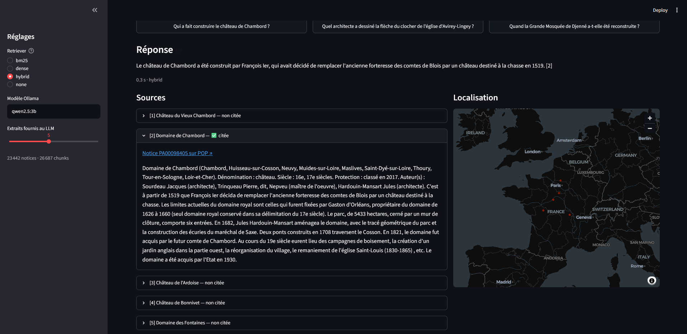

# 🏛️ merimee-rag — un RAG évalué sur les monuments historiques français

Système de questions-réponses sur la **base Mérimée** (immeubles protégés au titre des Monuments historiques, Ministère de la Culture), construit sur les **23 442 notices** qui ont un **historique** rédigé (≈ 2,4 millions de mots, 26 687 passages indexés). Tout tourne en local : embeddings open-source, LLM via **Ollama**, aucune clé d'API.



*Démo Streamlit (`streamlit run app.py`) : réponse générée par `qwen2.5:3b` en recherche hybride, citant la notice source [2], avec les extraits récupérés et leur localisation.*

Le but du projet n'est pas seulement de *faire* un RAG, mais de **mesurer** ce qu'il vaut :

- quel retriever retrouve la bonne notice ? **BM25 vs dense vs hybride**, avec intervalles de confiance et tests appariés ;
- la réponse est-elle **juste**, **ancrée dans la source**, **correctement citée** ?
- le système **s'abstient-il** quand la réponse n'est pas dans la base ?
- que gagne-t-on par rapport au **même LLM sans RAG** ?

```
question ─▶ retriever ─▶ top-k extraits ─▶ LLM (Ollama) ─▶ réponse citée [1][2]
             │                                            ou « Je ne trouve pas… »
             ├─ BM25 (analyse française : élisions, stopwords, Snowball)
             ├─ dense (multilingual-e5-small, produit scalaire numpy)
             ├─ hybride (Reciprocal Rank Fusion)
             └─ Solr (optionnel : l'index du projet de cours)
```

## Résultats

Évaluation sur GPU T4 (Colab) : générateur `qwen2.5:3b`, juge `qwen2.5:7b`, 141 questions générées
automatiquement (dont 115 bien posées) + 15 questions hors corpus. Détail complet, intervalles de
confiance et tests : [`results/REPORT.md`](results/REPORT.md).

**Le RAG fait plus que doubler l'exactitude du même modèle.**

| Questions bien posées (n = 40) | Exactitude | Ancrage dans la notice source | Citation de la bonne notice |
|---|---|---|---|
| LLM seul | 0,36 | 0,68 | – |
| RAG – BM25 | **0,86** | **0,93** | **0,95** |
| RAG – dense | 0,83 | 0,86 | 0,90 |
| RAG – hybride | **0,86** | 0,92 | **0,95** |

Sur les 50 questions, le RAG (BM25) améliore la réponse dans 35 cas et la dégrade dans 4.


**Retrieval : l'hybride est premier sur les questions bien posées… mais la conclusion dépend du jeu de test.**

| MRR@10 | 141 questions | 115 bien posées |
|---|---|---|
| BM25 | **0,861** | 0,903 |
| Dense (`multilingual-e5-small`) | 0,773 | 0,882 |
| Hybride (RRF) | 0,839 | **0,925** |

- Sur l'ensemble brut, BM25 domine nettement le dense (p = 0,002). Mais 26 questions générées sont
  **sous-spécifiées** (« Quel était le rôle de ce fort au 17e siècle ? ») : seul un mot rare
  (un nom de famille, une rue) permet de les retrouver, ce qui avantage mécaniquement BM25.
- Sans elles, l'écart BM25/dense disparaît (p = 0,39) et **l'hybride passe en tête**
  (Hit@1 0,90 ; significatif face au dense, p = 0,03 ; pas face à BM25, p = 0,14).
- Même effet selon le **recouvrement lexical** question/notice : quand la question reformule
  (faible recouvrement), dense et hybride battent BM25 ; quand elle recopie la notice, BM25 l'emporte.
  Des questions synthétiques surestiment donc BM25 par rapport à de vrais utilisateurs.


**Ce qui reste à améliorer (analyse d'erreurs)**

- **La génération est le maillon faible, pas le retrieval** : avec BM25, sur 50 questions, 12 échecs
  alors que la bonne notice était fournie, contre 4 échecs de retrieval. Un générateur plus gros
  (7B au lieu de 3B) est la piste la plus directe ; pas encore évaluée ici.
- **Questions hors corpus** : 13/15 refus corrects en BM25, 14/15 en dense, mais 9/15 seulement en
  hybride (écart non significatif sur 15 questions). Les pièges restants sont instructifs : la base
  contient une *église Notre-Dame-de-la-Paix* française (confondue avec la basilique de Yamoussoukro)
  et plusieurs « tours de l'horloge » (attribuées à Big Ben).

**Limites** : juge automatique non validé contre une annotation humaine ; une seule notice « correcte »
par question ; 50 questions pour la génération (intervalles de confiance larges).

## Choix de conception

| Choix | Pourquoi |
|---|---|
| **Chunking contextuel** : chaque passage est préfixé par « Titre (Commune, Département). Dénomination. Siècle. » | Un passage isolé (« Le clocher fut reconstruit en 1760 ») est inutilisable sans savoir de quel monument il parle ; l'en-tête le rend retrouvable et citable. |
| Découpage ~180 mots, aligné sur les phrases, recouvrement ~40 mots | Les historiques Mérimée vont de 2 lignes à plusieurs pages. |
| **Fusion RRF** plutôt que somme pondérée des scores | Les scores BM25 et cosinus ne sont pas sur la même échelle ; RRF ne dépend que des rangs, sans hyperparamètre à régler sur le test. |
| E5 avec préfixes `query:` / `passage:` | Requis par le modèle ; les oublier dégrade nettement le retrieval. |
| Recherche exacte numpy, pas de FAISS | ~27 k vecteurs × 384 dims ≈ 40 Mo : exact et assez rapide, une dépendance de moins (utile sous Windows). |
| Évaluation au **niveau notice** | Plusieurs chunks d'une même notice ne doivent pas compter plusieurs fois. |
| **Juge ≠ générateur** (qwen2.5:7b juge qwen2.5:3b) | Limite le biais d'auto-préférence du LLM-juge. |
| Fidélité décomposée en **affirmations atomiques** | Plus robuste et plus interprétable qu'une note globale 1-5 (on voit quelle phrase est inventée). |
| **Cache disque** des appels LLM | Une évaluation de plusieurs heures est reprenable après un plantage. |

## Protocole d'évaluation

**Jeu de test** (`eval/build_testset.py`)
- Questions **synthétiques** : échantillon de notices **stratifié par région** ; le LLM écrit une question (qui nomme le monument et la commune), la réponse, et **l'extrait mot pour mot** qui la justifie. Si l'extrait ne se retrouve pas dans l'historique, la paire est rejetée : filtre automatique contre les questions inventées.
- **15 questions hors corpus** écrites à la main (Djenné, Loropéni, Abomey, Alhambra…) : la seule bonne réponse est l'abstention.
- Possibilité d'ajouter des **questions manuelles** (`--manual`), recommandé pour valider le jeu synthétique.

**Retrieval** (`eval/eval_retrieval.py`) : Hit@1, Hit@5, Recall@10, MRR@10, nDCG@10 · IC 95 % par bootstrap · bootstrap apparié entre retrievers · résultats par tranche de **recouvrement lexical** question/notice.

**Génération** (`eval/eval_generation.py`), pour `no-rag`, `rag-bm25`, `rag-dense`, `rag-hybrid` :

| Métrique | Mesure |
|---|---|
| Exactitude | juge vs réponse de référence (correct 1 / partiel 0,5 / incorrect 0) |
| Ancrage (notice) | part des affirmations soutenues par la notice source : **taux d'hallucination comparable entre toutes les configs, y compris sans RAG** |
| Fidélité (extraits) | part des affirmations soutenues par les extraits fournis |
| Citation juste | la notice source est parmi les extraits cités |
| Citation valide | pas de numéro cité inexistant |
| Abstention à tort / hors corpus | refus sur une question répondable / refus attendu (refus **seul**) |
| Réponse hybride | refus + faits affirmés dans la même réponse : jugée comme une réponse, jamais comptée comme abstention réussie |
| Analyse d'erreurs | chaque échec est attribué au **retrieval** (notice non récupérée) ou à la **génération** |

**Limites assumées**
- Les questions générées à partir d'un texte en reprennent le vocabulaire, ce qui **favorise BM25** : d'où la consigne de reformulation et l'analyse par recouvrement lexical.
- Une seule notice « gold » par question, alors que d'autres notices (parties d'un même ensemble) peuvent aussi répondre : les scores de retrieval sont une **borne basse**.
- Le LLM-juge est lui-même un modèle de 7B : pour un résultat publiable, annoter à la main un échantillon et mesurer l'accord juge/humain.

## Installation (Windows / PowerShell ; sous Linux/macOS : `source .venv/bin/activate`)

```powershell
git clone https://github.com/ezechiel-sawadogo-nlp/merimee-rag.git
cd merimee-rag
python -m venv .venv ; .venv\Scripts\Activate.ps1
pip install -e ".[dev]"

ollama pull qwen2.5:3b     # générateur
ollama pull qwen2.5:7b     # juge (et génération des questions)
```

## Utilisation

```powershell
merimee-rag prepare         # data/monuments.json.gz (fourni) → notices avec historique → data/corpus.jsonl
merimee-rag index           # chunks + BM25 (~1 min) + embeddings (CPU : compter 10-30 min)

merimee-rag ask "Qui a fait construire le château de Chambord ?"
merimee-rag ask "..." --retriever none      # même LLM, sans la base
streamlit run app.py                        # démo web
```

## Reproduire l'évaluation

```powershell
python -m eval.build_testset --n 150             # ~150 questions + 15 hors corpus
python -m eval.eval_retrieval                    # rapide (quelques minutes)
python -m eval.eval_generation --limit 50        # long sur CPU : voir ci-dessous
python -m eval.report                            # → results/REPORT.md + figures
python -m eval.smoke                             # test de non-régression rapide (8 questions)
```

Pas de GPU ? Le notebook [`notebooks/colab_eval.ipynb`](notebooks/colab_eval.ipynb) enchaîne toute
l'évaluation sur un GPU T4 gratuit de Google Colab (c'est ainsi qu'ont été obtenus les résultats ci-dessus).
Après une modification de l'analyse (et sans rappeler aucun LLM) : `python -m eval.rescore`.

Coût de la génération : `limit × 4 configs` réponses + jusqu'à 3 appels juge par réponse. Sur un portable sans GPU, compter plusieurs heures pour `--limit 50` ; `--configs no-rag rag-hybrid` pour une première passe. Grâce au cache, une exécution interrompue reprend là où elle s'est arrêtée.

Variables d'environnement utiles : `MERIMEE_GEN_MODEL`, `MERIMEE_JUDGE_MODEL`, `MERIMEE_EMBED_MODEL`, `MERIMEE_TOPK_CTX`, `MERIMEE_SOLR_URL` (ex. `http://localhost:8983/solr/merimee` pour ajouter l'index Solr du cours comme 4ᵉ retriever).

## Tests

```powershell
pytest     # notices fictives, encodeur et LLM factices : ni téléchargement ni Ollama
```

## Données

Base Mérimée — [Immeubles protégés au titre des Monuments historiques](https://www.data.gouv.fr/datasets/immeubles-proteges-au-titre-des-monuments-historiques-2), © Ministère de la Culture, [Licence Ouverte 2.0](https://www.etalab.gouv.fr/licence-ouverte-open-licence/). Chaque réponse renvoie vers la notice sur la [Plateforme ouverte du patrimoine (POP)](https://pop.culture.gouv.fr).

`data/monuments.json.gz` (7 Mo) est un extrait nettoyé de cette base (24 824 notices, champs normalisés),
préparé pour un projet de moteur de recherche Solr et redistribué ici sous la même licence. Pour repartir de
la base brute : `merimee-rag download`, puis `merimee-rag inspect` pour vérifier la correspondance des
colonnes (le format du CSV officiel évolue).

## Licence

Code sous licence MIT. Données : Licence Ouverte 2.0 (voir ci-dessus).
