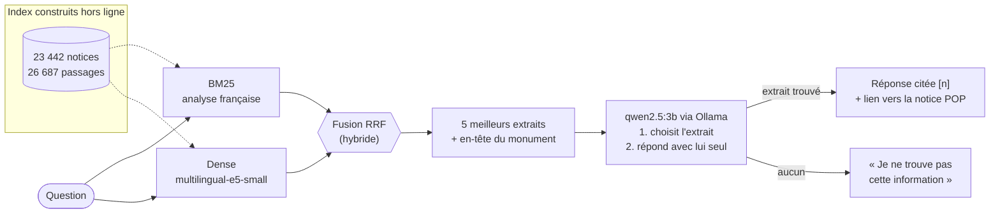
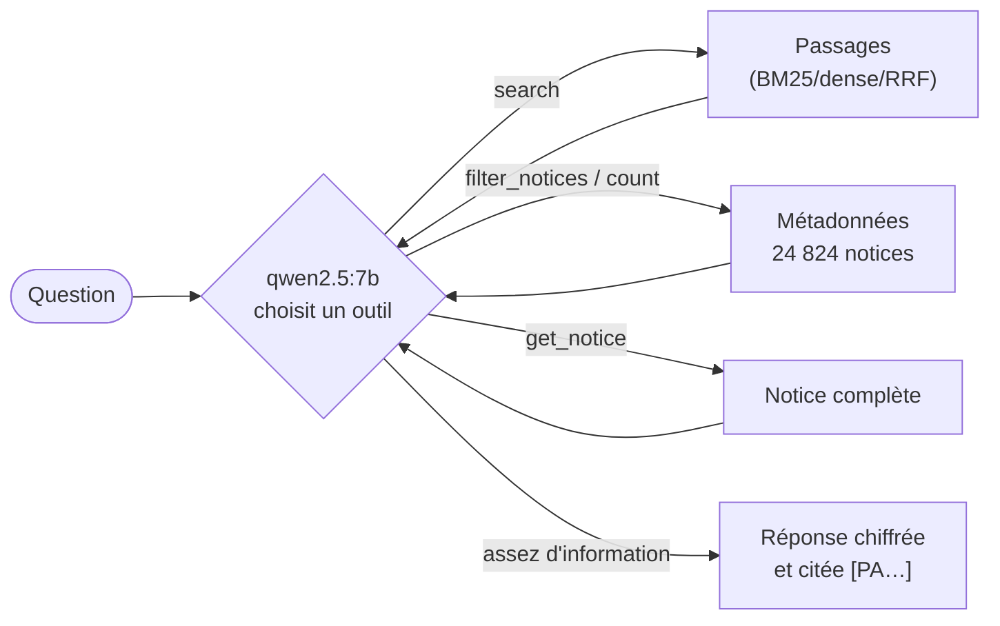
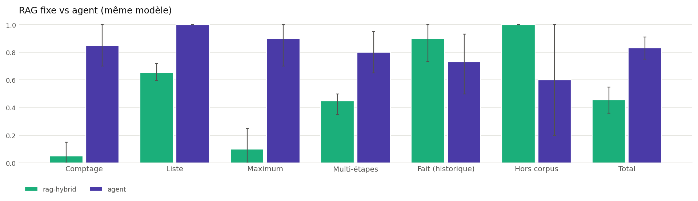
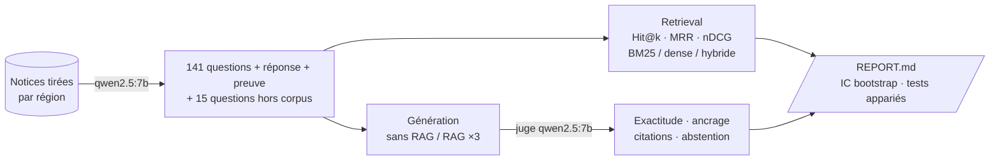

# 🏛️ merimee-rag — un RAG évalué sur les monuments historiques français

Système de questions-réponses sur la **base Mérimée** (immeubles protégés au titre des Monuments historiques, Ministère de la Culture), construit sur les **23 442 notices** qui ont un **historique** rédigé (≈ 2,4 millions de mots, 26 687 passages indexés). Tout tourne en local : embeddings open-source, LLM via **Ollama**, aucune clé d'API.


*Démo Streamlit (`streamlit run app.py`) : réponse générée par `qwen2.5:3b` en recherche hybride, citant la notice source [2], avec les extraits récupérés et leur localisation.*

Le but du projet n'est pas seulement de *faire* un RAG, mais de **mesurer** ce qu'il vaut :

- quel retriever retrouve la bonne notice ? **BM25 vs dense vs hybride**, avec intervalles de confiance et tests appariés ;
- la réponse est-elle **juste**, **ancrée dans la source**, **correctement citée** ?
- le système **s'abstient-il** quand la réponse n'est pas dans la base ?
- que gagne-t-on par rapport au **même LLM sans RAG** ?
- un **agent** qui choisit lui-même ses outils (recherche, filtres, comptages) fait-il mieux qu'un RAG fixe ? (voir [Mode agent](#mode-agent--le-modèle-choisit-ses-outils))



*Architecture détaillée du code (générée automatiquement) : [GitDiagram](https://gitdiagram.com/ezechiel-sawadogo-nlp/merimee-rag).*

## Résultats

Évaluation sur GPU T4 (Colab) : générateur `qwen2.5:3b`, juge `qwen2.5:7b`, 141 questions générées
automatiquement (dont 115 bien posées) + 15 questions hors corpus. Détail complet, intervalles de
confiance et tests : [`results/REPORT.md`](results/REPORT.md).

**Le RAG fait plus que doubler l'exactitude du même modèle.**

| Questions bien posées (n = 40) | Exactitude | Ancrage dans la notice source | Citation de la bonne notice |
|---|---|---|---|
| LLM seul | 0,36 | 0,68 | – |
| RAG – BM25 | **0,86** | **0,93** | **0,95** |
| RAG – dense | 0,83 | 0,86 | 0,90 |
| RAG – hybride | **0,86** | 0,92 | **0,95** |

Sur les 50 questions, le RAG (BM25) améliore la réponse dans 35 cas et la dégrade dans 4.


**Retrieval : l'hybride est premier sur les questions bien posées… mais la conclusion dépend du jeu de test.**

| MRR@10 | 141 questions | 115 bien posées |
|---|---|---|
| BM25 | **0,861** | 0,903 |
| Dense (`multilingual-e5-small`) | 0,773 | 0,882 |
| Hybride (RRF) | 0,839 | **0,925** |

- Sur l'ensemble brut, BM25 domine nettement le dense (p = 0,002). Mais 26 questions générées sont
  **sous-spécifiées** (« Quel était le rôle de ce fort au 17e siècle ? ») : seul un mot rare
  (un nom de famille, une rue) permet de les retrouver, ce qui avantage mécaniquement BM25.
- Sans elles, l'écart BM25/dense disparaît (p = 0,39) et **l'hybride passe en tête**
  (Hit@1 0,90 ; significatif face au dense, p = 0,03 ; pas face à BM25, p = 0,14).
- Même effet selon le **recouvrement lexical** question/notice : quand la question reformule
  (faible recouvrement), dense et hybride battent BM25 ; quand elle recopie la notice, BM25 l'emporte.
  Des questions synthétiques surestiment donc BM25 par rapport à de vrais utilisateurs.


**Ce qui reste à améliorer (analyse d'erreurs)**

- **La génération est le maillon faible, pas le retrieval** : avec BM25, sur 50 questions, 12 échecs
  alors que la bonne notice était fournie, contre 4 échecs de retrieval. Un générateur plus gros
  (7B au lieu de 3B) est la piste la plus directe ; pas encore évaluée ici.
- **Questions hors corpus** : 13/15 refus corrects en BM25, 14/15 en dense, mais 9/15 seulement en
  hybride (écart non significatif sur 15 questions). Les pièges restants sont instructifs : la base
  contient une *église Notre-Dame-de-la-Paix* française (confondue avec la basilique de Yamoussoukro)
  et plusieurs « tours de l'horloge » (attribuées à Big Ben).

**Limites** : juge automatique non validé contre une annotation humaine ; une seule notice « correcte »
par question ; 50 questions pour la génération (intervalles de confiance larges).

## Mode agent : le modèle choisit ses outils

Le RAG fixe répond bien à « qui a construit Chambord ? », mais pas à « combien d'églises classées
dans l'Aube ? » : la réponse n'est écrite dans aucun passage, elle se *calcule*. Le mode agent donne
au LLM (`qwen2.5:7b`, *tool calling* natif d'Ollama, tout en local) quatre outils, et le laisse décider
lesquels appeler, dans quel ordre, jusqu'à pouvoir répondre :

| Outil | Rôle |
|---|---|
| `search(query, method)` | recherche BM25 / dense / hybride dans les historiques (le RAG, en outil) |
| `filter_notices(commune, departement, region, denomination, siecle, protection, …)` | liste les notices qui satisfont des critères structurés |
| `count(…, group_by)` | comptages et agrégations (« quel département en a le plus ? ») |
| `get_notice(ref)` | notice complète : historique, auteurs, dates |



Choix de conception :
- les filtres et comptages portent sur **toute la base** (24 824 notices), pas seulement sur celles qui
  ont un historique ; valeurs comparées sans accents ni casse, pluriels tolérés (« châteaux ») ;
- un outil n'échoue jamais en silence : une valeur inconnue renvoie une **erreur avec suggestions**
  (« "Bourgogne" correspond à : Bourgogne-Franche-Comté (champ région) »), et l'agent se corrige à
  l'étape suivante ;
- chaque étape est tracée (outil, arguments, résultat, durée), ce qui rend l'agent **évaluable** ;
- les **citations sont vérifiées** : une référence citée qui ne sort d'aucun outil est signalée comme
  inventée, et les **filtres ajoutés sans que la question les demande** sont comptés (deux dérives
  observées avec `qwen2.5:7b` dès les premiers essais).

```powershell
merimee-rag agent "Quel département du Centre-Val de Loire compte le plus de châteaux classés ?"
# Trace attendue (les chiffres sont ceux que renvoie l'outil sur la base) :
#  1. count({"region": "Centre-Val de Loire", "denomination": "château", "protection": "classé",
#            "group_by": "departement"}) → total=144
#  → L'Indre-et-Loire, avec 40 châteaux classés.
```

Dans la démo Streamlit, le sélecteur **Mode : Agent** affiche les étapes de l'agent.

**Évaluation RAG fixe vs agent** ([`eval/eval_agent.py`](eval/eval_agent.py)) : 72 questions dont les
réponses sont **calculées sur les données** (donc exactes, sans juge) — comptages, listes de notices,
maxima par département, questions multi-étapes (« qui est l'architecte de X, et combien de monuments
lui sont attribués ? ») — plus des questions factuelles sur l'historique (le terrain du RAG) et hors
corpus. Même modèle pour les deux systèmes : seule l'architecture change. Mesures : exactitude par type,
bon choix d'outil, nombre d'appels, appels en erreur, filtres et citations inventés, latence, et un **diagnostic de chaque échec**
(aucun outil, mauvais outil, mauvais arguments, ou bonne donnée obtenue mais mal restituée).

### Résultats : RAG fixe vs agent

Colab (GPU T4), `qwen2.5:7b` pour les deux systèmes, juge `qwen2.5:7b` pour les questions factuelles.
Intervalles de confiance bootstrap à 95 %. Détail : [`results/REPORT.md`](results/REPORT.md).

| Type de question | n | RAG fixe | Agent |
|---|---|---|---|
| Comptage (« combien d'églises classées dans l'Aube ? ») | 20 | 0,05 | **0,85** |
| Liste (« quels monuments protégés à Monestiés ? ») | 12 | 0,65 | **1,00** |
| Maximum (« quel département a le plus de… ? ») | 10 | 0,10 | **0,90** |
| Multi-étapes (architecte de X, puis ses autres monuments) | 10 | 0,45 | **0,80** |
| Fait tiré d'un historique | 15 | **0,90** | 0,73 |
| Hors corpus (doit refuser) | 5 | **1,00** | 0,60 |
| **Total** | 72 | 0,46 <sub>[0,36–0,55]</sub> | **0,83** <sub>[0,75–0,91]</sub> |



- **Le gain est là où la réponse se calcule.** Le RAG fixe ne voit que 5 passages : il ne peut ni
  compter ni classer, et répond au hasard (0,05 en comptage). L'agent appelle `count` et recopie le
  chiffre exact.
- **Sur le terrain du RAG, l'agent perd un peu.** Il est moins bon sur les faits tirés des historiques
  (0,73 contre 0,90), parce qu'il lui arrive de choisir `filter_notices` au lieu de `search`. Il refuse
  aussi moins bien les questions hors corpus. Les deux architectures sont donc **complémentaires** : un
  routeur (questions factuelles vers le RAG, le reste vers l'agent) serait l'étape suivante.
- **Comportement** : 1,04 appel d'outil par question en moyenne, bon outil dans 87 % des cas, aucune
  citation inventée, aucun filtre inventé. Latence d'environ 4 s par question sur T4, du même ordre
  que le RAG fixe.

**Trois itérations guidées par l'analyse d'erreurs.** Chaque version corrige les échecs diagnostiqués
dans la précédente ; même modèle, mêmes questions.

| | RAG fixe | agent v1 | agent v2 | agent v3 |
|---|---|---|---|---|
| Comptage | 0,05 | 0,95 | 0,95 | 0,85 |
| Liste | 0,65 | 0,83 | 0,37 | **1,00** |
| Maximum | 0,10 | 1,00 | 0,90 | 0,90 |
| Multi-étapes | 0,45 | 0,30 | **0,80** | **0,80** |
| Fait (historique) | **0,90** | 0,43 | 0,07 | 0,73 |
| Hors corpus | **1,00** | **1,00** | 0,80 | 0,60 |
| **Total** | 0,46 | 0,74 | 0,63 | **0,83** |

1. **Premiers essais en local.** Ils ont fait apparaître trois dérives : une syntaxe de requête
   inventée (`departement: {"$in": [...]}`), des bornes de dates ajoutées sans raison (38 au lieu
   de 40), et une référence recopiée depuis l'exemple du prompt. Corrections : valeurs non scalaires
   refusées avec une piste (`group_by`), prompt nettoyé, vérification des citations.
2. **v1 → v2.** En multi-étapes, l'agent ne trouvait pas le nom exact de l'architecte avant de
   compter. `search` renvoie désormais les auteurs de chaque notice, et le prompt décrit
   l'enchaînement `search` → `count(auteur=…)` : ce type passe de 0,30 à 0,80. En liste, un filtre `protection="inscrit"` était ajouté dans 12 listes sur 12 : une
   consigne a été ajoutée au prompt.
3. **La v2 régresse (0,63), et le diagnostic dit pourquoi.** J'avais ajouté des paramètres `commune`
   et `departement` à `search` : le modèle s'est mis à l'utiliser comme un outil de filtrage, sans
   `query`, et 92 % de ses appels sur les questions factuelles ont échoué. En liste, le filtre inventé
   est simplement passé de `"inscrit"` à `"classé"` : le modèle veut exprimer « protégé » et n'a pas
   de valeur valide pour le dire.
4. **v3 : corriger les outils plutôt que le prompt.** `search` n'expose plus que `query`, et reconstruit
   la requête s'il reçoit des critères à la place. `protection` accepte la valeur `"tous"`. Une commune
   homonyme sans département déclenche un avertissement. Résultat : Liste 1,00 et Fait 0,73, sans filtre
   inventé. Leçon : un petit modèle suit mieux **une interface d'outil bien conçue qu'une consigne
   de plus dans le prompt**.

**Erreurs restantes (v3)**

- **Sous-filtrage**, l'inverse de la v1 : pour « croix inscrites dans le Bas-Rhin », l'agent oublie
  `denomination="croix"` (2 comptages sur 20).
- **Multi-étapes arrêtées trop tôt** (4 sur 10) : après `search`, l'agent donne l'architecte (juste)
  puis un nombre de monuments sans avoir appelé `count`. Ce nombre est donc inventé, et une fois, le
  nom de l'architecte aussi.
- **Mauvais outil sur les faits** (3 sur 15) : `filter_notices` au lieu de `search`.
- **Hors corpus** : les 2 échecs sont en fait des refus accompagnés d'une phrase d'explication
  (« Neuschwanstein est situé en Allemagne »). La notation, stricte, compte tout refus accompagné
  d'une affirmation comme une réponse. Je ne l'ai pas assouplie après coup.
- **Ambiguïté du jeu de test** : dans 2 questions sur les « immeubles inscrits », *immeuble* a son sens
  juridique (tout bâtiment) pour un lecteur, mais le sens de la dénomination Mérimée dans la réponse
  attendue.

**Limites** : les trois versions ont été mises au point sur **les mêmes 72 questions**, donc le score
de la v3 est optimiste. Il faudrait un jeu de questions tenu à l'écart pour le confirmer, et c'est
pour ça que je me suis arrêté à la v3. Les effectifs par type sont petits (5 à 20 questions), et un
seul run a été fait par version.

## Choix de conception

| Choix | Pourquoi |
|---|---|
| **Chunking contextuel** : chaque passage est préfixé par « Titre (Commune, Département). Dénomination. Siècle. » | Un passage isolé (« Le clocher fut reconstruit en 1760 ») est inutilisable sans savoir de quel monument il parle ; l'en-tête le rend retrouvable et citable. |
| Découpage ~180 mots, aligné sur les phrases, recouvrement ~40 mots | Les historiques Mérimée vont de 2 lignes à plusieurs pages. |
| **Fusion RRF** plutôt que somme pondérée des scores | Les scores BM25 et cosinus ne sont pas sur la même échelle ; RRF ne dépend que des rangs, sans hyperparamètre à régler sur le test. |
| E5 avec préfixes `query:` / `passage:` | Requis par le modèle ; les oublier dégrade nettement le retrieval. |
| Recherche exacte numpy, pas de FAISS | ~27 k vecteurs × 384 dims ≈ 40 Mo : exact et assez rapide, une dépendance de moins (utile sous Windows). |
| Évaluation au **niveau notice** | Plusieurs chunks d'une même notice ne doivent pas compter plusieurs fois. |
| **Juge ≠ générateur** (qwen2.5:7b juge qwen2.5:3b) | Limite le biais d'auto-préférence du LLM-juge. |
| Fidélité décomposée en **affirmations atomiques** | Plus robuste et plus interprétable qu'une note globale 1-5 (on voit quelle phrase est inventée). |
| **Cache disque** des appels LLM | Une évaluation de plusieurs heures est reprenable après un plantage. |

## Protocole d'évaluation



**Jeu de test** (`eval/build_testset.py`)
- Questions **synthétiques** : échantillon de notices **stratifié par région** ; le LLM écrit une question (qui nomme le monument et la commune), la réponse, et **l'extrait mot pour mot** qui la justifie. Si l'extrait ne se retrouve pas dans l'historique, la paire est rejetée : filtre automatique contre les questions inventées.
- **15 questions hors corpus** écrites à la main (Djenné, Loropéni, Abomey, Alhambra…) : la seule bonne réponse est l'abstention.
- Possibilité d'ajouter des **questions manuelles** (`--manual`), recommandé pour valider le jeu synthétique.

**Retrieval** (`eval/eval_retrieval.py`) : Hit@1, Hit@5, Recall@10, MRR@10, nDCG@10 · IC 95 % par bootstrap · bootstrap apparié entre retrievers · résultats par tranche de **recouvrement lexical** question/notice.

**Génération** (`eval/eval_generation.py`), pour `no-rag`, `rag-bm25`, `rag-dense`, `rag-hybrid` :

| Métrique | Mesure |
|---|---|
| Exactitude | juge vs réponse de référence (correct 1 / partiel 0,5 / incorrect 0) |
| Ancrage (notice) | part des affirmations soutenues par la notice source : **taux d'hallucination comparable entre toutes les configs, y compris sans RAG** |
| Fidélité (extraits) | part des affirmations soutenues par les extraits fournis |
| Citation juste | la notice source est parmi les extraits cités |
| Citation valide | pas de numéro cité inexistant |
| Abstention à tort / hors corpus | refus sur une question répondable / refus attendu (refus **seul**) |
| Réponse hybride | refus + faits affirmés dans la même réponse : jugée comme une réponse, jamais comptée comme abstention réussie |
| Analyse d'erreurs | chaque échec est attribué au **retrieval** (notice non récupérée) ou à la **génération** |

**Limites assumées**
- Les questions générées à partir d'un texte en reprennent le vocabulaire, ce qui **favorise BM25** : d'où la consigne de reformulation et l'analyse par recouvrement lexical.
- Une seule notice « gold » par question, alors que d'autres notices (parties d'un même ensemble) peuvent aussi répondre : les scores de retrieval sont une **borne basse**.
- Le LLM-juge est lui-même un modèle de 7B : pour un résultat publiable, annoter à la main un échantillon et mesurer l'accord juge/humain.

## Installation (Windows / PowerShell ; sous Linux/macOS : `source .venv/bin/activate`)

```powershell
git clone https://github.com/ezechiel-sawadogo-nlp/merimee-rag.git
cd merimee-rag
python -m venv .venv ; .venv\Scripts\Activate.ps1
pip install -e ".[dev]"

ollama pull qwen2.5:3b     # générateur
ollama pull qwen2.5:7b     # agent, juge et génération des questions
```

## Avec Docker (tout en une commande)

```powershell
docker compose up --build        # puis http://localhost:8501
```

Trois services : `ollama` (serveur de modèles), `ollama-init` (télécharge `qwen2.5:3b` et `qwen2.5:7b`
une seule fois, ~7 Go) et `app` (démo Streamlit ; au premier démarrage, construit le corpus et les
index dans un volume, puis les réutilise). Tout est conservé entre deux lancements.

```powershell
docker compose exec app merimee-rag agent "Quel département compte le plus de moulins protégés ?"
docker compose -f docker-compose.yml -f docker-compose.gpu.yml up --build   # avec GPU NVIDIA
```

Sans GPU, compter 10 à 30 s par réponse du 7B. `MERIMEE_NO_DENSE=1 docker compose up` démarre plus vite
(recherche BM25 seulement, sans calcul des embeddings).

## Utilisation

```powershell
merimee-rag prepare         # data/monuments.json.gz (fourni) → notices avec historique → data/corpus.jsonl
merimee-rag index           # chunks + BM25 (~1 min) + embeddings (CPU : compter 10-30 min)

merimee-rag ask "Qui a fait construire le château de Chambord ?"
merimee-rag ask "..." --retriever none      # même LLM, sans la base
merimee-rag agent "Combien d'églises classées dans le département « Aube » ?"
streamlit run app.py                        # démo web
```

## Reproduire l'évaluation

```powershell
python -m eval.build_testset --n 150             # ~150 questions + 15 hors corpus
python -m eval.eval_retrieval                    # rapide (quelques minutes)
python -m eval.eval_generation --limit 50        # long sur CPU : voir ci-dessous
python -m eval.report                            # → results/REPORT.md + figures
python -m eval.smoke                             # test de non-régression rapide (8 questions)

python -m eval.agent_questions                   # 72 questions à réponses calculées (déjà fournies)
python -m eval.eval_agent                        # RAG fixe vs agent → results/agent_*.csv
python -m eval.report
```

Pas de GPU ? Le notebook [`notebooks/colab_eval.ipynb`](notebooks/colab_eval.ipynb) enchaîne toute
l'évaluation sur un GPU T4 gratuit de Google Colab (c'est ainsi qu'ont été obtenus les résultats ci-dessus).
Après une modification de l'analyse (et sans rappeler aucun LLM) : `python -m eval.rescore`.

Coût de la génération : `limit × 4 configs` réponses + jusqu'à 3 appels juge par réponse. Sur un portable sans GPU, compter plusieurs heures pour `--limit 50` ; `--configs no-rag rag-hybrid` pour une première passe. Grâce au cache, une exécution interrompue reprend là où elle s'est arrêtée.

Variables d'environnement utiles : `MERIMEE_GEN_MODEL`, `MERIMEE_AGENT_MODEL`, `MERIMEE_AGENT_MAX_STEPS`, `MERIMEE_JUDGE_MODEL`, `MERIMEE_EMBED_MODEL`, `MERIMEE_TOPK_CTX`, `MERIMEE_SOLR_URL` (ex. `http://localhost:8983/solr/merimee` pour ajouter l'index Solr du cours comme 4ᵉ retriever).

## Tests

```powershell
pytest     # notices fictives, encodeur et LLM factices : ni téléchargement ni Ollama
```

## Données

Base Mérimée — [Immeubles protégés au titre des Monuments historiques](https://www.data.gouv.fr/datasets/immeubles-proteges-au-titre-des-monuments-historiques-2), © Ministère de la Culture, [Licence Ouverte 2.0](https://www.etalab.gouv.fr/licence-ouverte-open-licence/). Chaque réponse renvoie vers la notice sur la [Plateforme ouverte du patrimoine (POP)](https://pop.culture.gouv.fr).

`data/monuments.json.gz` (7 Mo) est un extrait nettoyé de cette base (24 824 notices, champs normalisés),
préparé pour un projet de moteur de recherche Solr et redistribué ici sous la même licence. Pour repartir de
la base brute : `merimee-rag download`, puis `merimee-rag inspect` pour vérifier la correspondance des
colonnes (le format du CSV officiel évolue).

## Licence

Code sous licence MIT. Données : Licence Ouverte 2.0 (voir ci-dessus).
