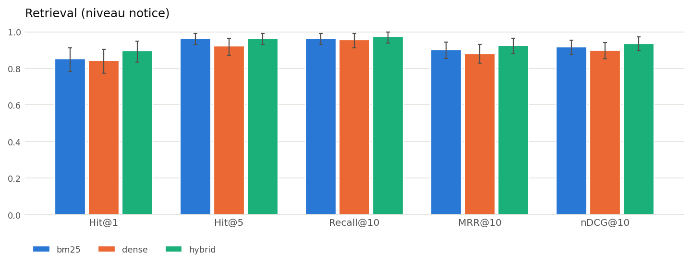
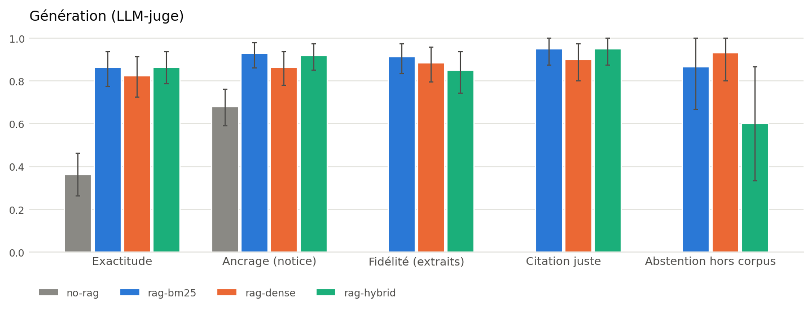

# Résultats — RAG Mérimée

Corpus : **23 442 notices** avec historique → **26 687 chunks** (180 mots, recouvrement 40). Embeddings : `intfloat/multilingual-e5-small`.

Moyennes avec intervalle de confiance à 95 % (bootstrap, 2 000 tirages) entre crochets.

## Retrieval

**115 questions bien posées** (sur 141 générées : les questions sous-spécifiées, qui ne nomment ni le monument ni la commune, sont écartées — voir `eval/ambiguity.py`).

| retriever | Hit@1 | Hit@5 | Recall@10 | MRR@10 | nDCG@10 |
|---|---|---|---|---|---|
| **bm25** | 0.852 [0.78–0.91] | 0.965 [0.93–0.99] | 0.965 [0.93–0.99] | 0.903 [0.86–0.94] | 0.919 [0.88–0.96] |
| **dense** | 0.843 [0.77–0.90] | 0.922 [0.87–0.97] | 0.957 [0.91–0.99] | 0.882 [0.83–0.93] | 0.900 [0.85–0.94] |
| **hybrid** | 0.896 [0.83–0.95] | 0.965 [0.93–0.99] | 0.974 [0.94–1.00] | 0.925 [0.88–0.96] | 0.937 [0.90–0.97] |

Sur les 141 questions, y compris sous-spécifiées

| retriever | Hit@1 | Hit@5 | Recall@10 | MRR@10 | nDCG@10 |
|---|---|---|---|---|---|
| **bm25** | 0.816 [0.75–0.88] | 0.922 [0.87–0.96] | 0.929 [0.89–0.97] | 0.861 [0.81–0.91] | 0.878 [0.83–0.92] |
| **dense** | 0.730 [0.65–0.80] | 0.816 [0.75–0.87] | 0.872 [0.82–0.92] | 0.773 [0.71–0.83] | 0.797 [0.74–0.85] |
| **hybrid** | 0.794 [0.73–0.86] | 0.894 [0.84–0.94] | 0.922 [0.87–0.96] | 0.839 [0.78–0.89] | 0.859 [0.81–0.91] |

**Comparaisons appariées (MRR@10, bootstrap apparié)**

| questions | A | B | Δ (A−B) | p |
|---|---|---|---|---|
| toutes | bm25 | dense | +0.088 | 0.002 |
| toutes | bm25 | hybrid | +0.023 | 0.235 |
| toutes | dense | hybrid | -0.065 | 0.001 |
| propres | bm25 | dense | +0.021 | 0.390 |
| propres | bm25 | hybrid | -0.022 | 0.138 |
| propres | dense | hybrid | -0.043 | 0.028 |

**MRR@10 selon le recouvrement lexical question/notice** (contrôle du biais des questions synthétiques en faveur de BM25)

| recouvrement | bm25 | dense | hybrid |
|---|---|---|---|
| faible | 0.816 | 0.837 | 0.841 |
| moyen | 0.877 | 0.794 | 0.873 |
| fort | 0.893 | 0.688 | 0.805 |

## Génération

40 questions répondables bien posées + 15 hors corpus. « Abstention hors corpus » n'est pas mesurée pour *no-rag*, dont la consigne ne demande pas de refuser.

| config | Exactitude | Ancrage (notice) | Fidélité (extraits) | Citation juste | Abstention à tort | Abstention hors corpus | Réponse hybride (refus + faits) | Latence |
|---|---|---|---|---|---|---|---|---|
| **no-rag** | 0.362 [0.26–0.46] | 0.680 [0.59–0.76] | – | – | 0.000 [0.00–0.00] | – | 0.000 [0.00–0.00] | – |
| **rag-bm25** | 0.863 [0.78–0.94] | 0.928 [0.86–0.98] | 0.913 [0.84–0.97] | 0.950 [0.88–1.00] | 0.025 [0.00–0.07] | 0.867 [0.67–1.00] | 0.000 [0.00–0.00] | 1.5 s |
| **rag-dense** | 0.825 [0.72–0.91] | 0.863 [0.78–0.94] | 0.885 [0.80–0.96] | 0.900 [0.80–0.97] | 0.000 [0.00–0.00] | 0.933 [0.80–1.00] | 0.000 [0.00–0.00] | 1.6 s |
| **rag-hybrid** | 0.863 [0.79–0.94] | 0.918 [0.85–0.97] | 0.850 [0.74–0.94] | 0.950 [0.88–1.00] | 0.000 [0.00–0.00] | 0.600 [0.33–0.87] | 0.000 [0.00–0.00] | 1.5 s |

Y compris les questions sous-spécifiées

| config | Exactitude | Ancrage (notice) | Fidélité (extraits) | Citation juste | Abstention à tort | Abstention hors corpus | Réponse hybride (refus + faits) | Latence |
|---|---|---|---|---|---|---|---|---|
| **no-rag** | 0.350 [0.26–0.45] | 0.652 [0.56–0.73] | – | – | 0.020 [0.00–0.06] | – | 0.000 [0.00–0.00] | – |
| **rag-bm25** | 0.790 [0.69–0.87] | 0.866 [0.78–0.94] | 0.897 [0.82–0.96] | 0.880 [0.78–0.96] | 0.020 [0.00–0.06] | 0.867 [0.67–1.00] | 0.000 [0.00–0.00] | 1.5 s |
| **rag-dense** | 0.750 [0.65–0.84] | 0.796 [0.70–0.89] | 0.838 [0.75–0.92] | 0.760 [0.64–0.88] | 0.020 [0.00–0.06] | 0.933 [0.80–1.00] | 0.000 [0.00–0.00] | 1.7 s |
| **rag-hybrid** | 0.780 [0.69–0.87] | 0.845 [0.75–0.93] | 0.835 [0.74–0.92] | 0.840 [0.74–0.94] | 0.020 [0.00–0.06] | 0.600 [0.33–0.87] | 0.000 [0.00–0.00] | 1.5 s |

**Analyse d'erreurs** (toutes questions répondables : d'où vient l'échec ?)

| config | abstention à tort | correct | échec génération | échec retrieval |
|---|---|---|---|---|
| rag-bm25 | 1 | 33 | 12 | 4 |
| rag-dense | 0 | 30 | 12 | 8 |
| rag-hybrid | 0 | 33 | 11 | 6 |
